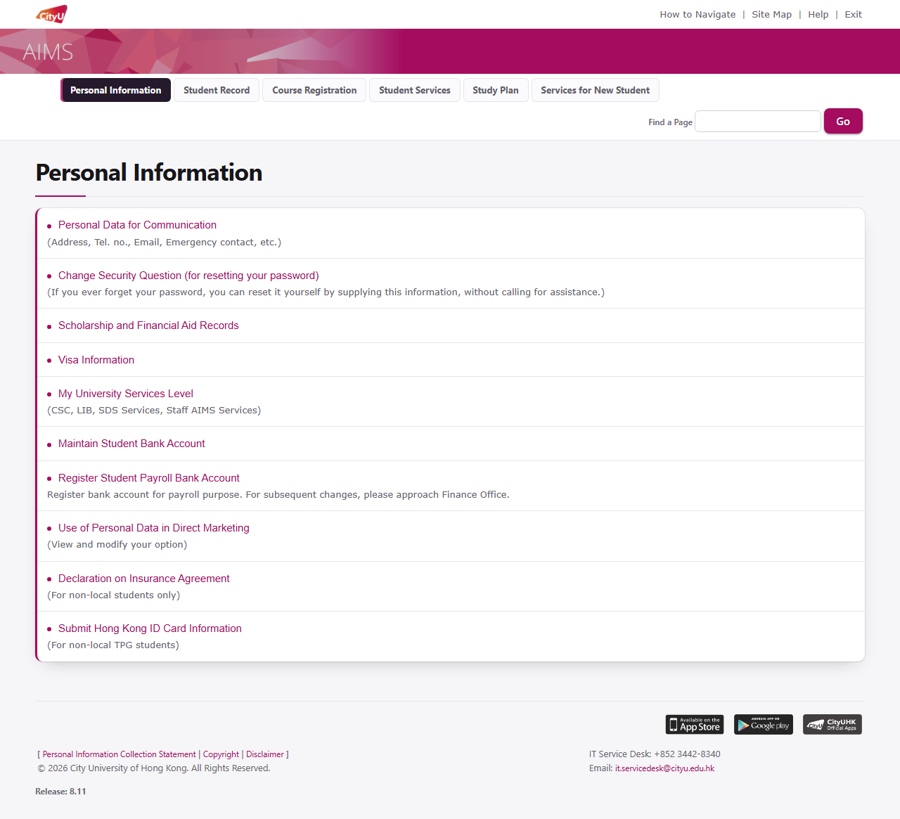
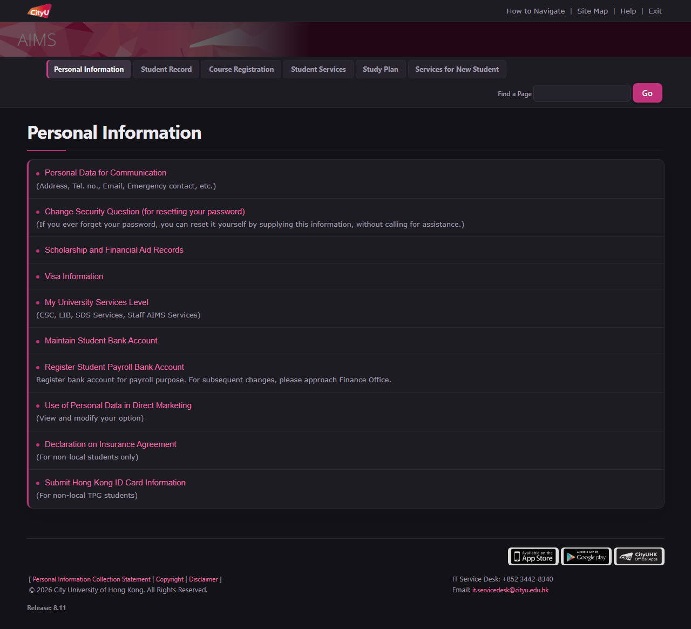
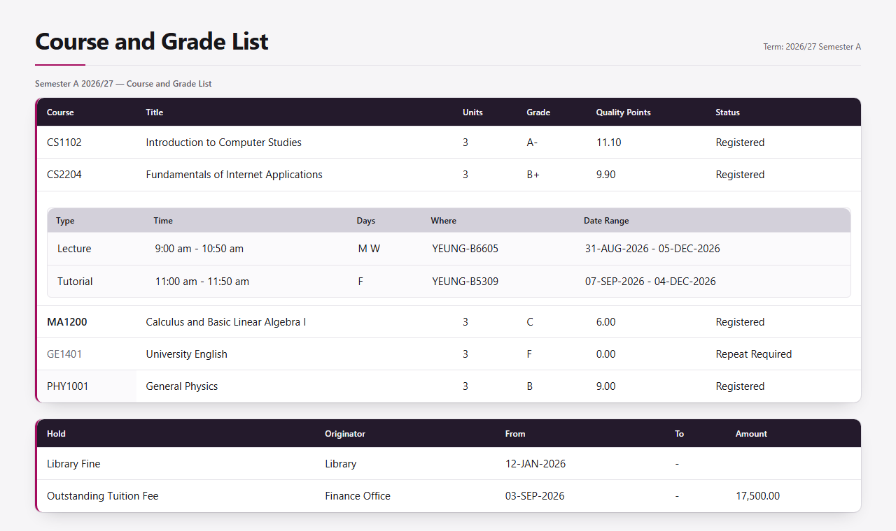

# ReAIMS

为香港城市大学 **AIMS** 系统做的界面重构 Chrome 扩展。

浅色与深色（同一页，主菜单）：

## 快速安装

本扩展未上架 Chrome 应用商店，用开发者模式加载。**不需要 Git，也不需要构建。**

1. 到 [Releases](https://github.com/zwang-JS/ReAIMS/releases/latest) 下载最新的 zip 压缩包（文件名形如 `ReAIMS-vX.Y.Z.zip`）
2. chrome浏览器右上角的三个点->扩展程序->管理扩展程序
3. 右上角打开 **开发者模式**
4. **把下载的 zip 压缩包直接拖进这个页面**，确认安装
5. 打开 AIMS，界面即生效

> **如果拖进去没反应**：把 zip 解压，点左上角 **加载已解压的扩展程序**，选择**解压出来的文件夹**
> （注意是文件夹，不是 zip 本身）。拖 zip 在部分 Chrome 版本上可行，而"解压后加载文件夹"
> 是官方文档写的那条路 —— 两条都列出来，免得卡住。

> **升级**：未打包的扩展不会自动更新。出新版本时重新下载 zip 拖一次即可（先删掉旧的，
> 或用同一个方式覆盖）。

没有构建步骤、没有 npm 依赖 —— 发布包里就是扩展本身（`manifest.json` + `icons/` + `src/`）。

## 功能

- **全站覆盖**：AIMS 的每一个子页面（个人资料、学生记录、选课、学生服务、成绩、课表…）共用同一套样式表，因此也共用同一套新样式，不需要逐页适配。
- **深浅色主题**：浅色 / 深色 / 跟随系统三选一。**首次进入默认浅色**，选择可跨设备同步。
- **三个切换入口**：扩展弹窗、页面右下角悬浮按钮、快捷键 `Alt`+`Shift`+`D`。
- **数据表重构**：梅墨表头条 + 表纸左缘的品红侧脊 + 圆角表纸 + 柔和阴影 + 发丝行线 + 悬停高亮 + 等宽数字对齐 + 表头吸顶。
- **导航重构**：顶栏改为现代吸顶导航；当前标签是一条梅墨条配品红索引边，与表头说同一种语言。
- **打印友好**：深色模式下打印不会打出黑底。

## 开发与贡献

样式是怎么分层的、预览台怎么用、几项检查各自负责什么，
移步 **[CONTRIBUTING.md](CONTRIBUTING.md)**。

## 已知限制

- **不含登录页**。AIMS 走 SAML SSO 跳转到 Okta（`auth.cityu.edu.hk`），那是已现代化、基于 Shadow DOM、且全校共用的非 AIMS 页面，本扩展刻意不碰。
- **不能重构 DOM**。只改样式，所以无法把一个表格变成 CSS Grid，也无法移动元素位置。像"把页面标题和搜索框放进同一行"这类调整只能靠 flex 容器与 `order` 实现。
- **仅覆盖 `banweb.cityu.edu.hk`**。AIMS 跳转到其它域名的页面不在范围内。
- **用弹窗改主题后，下一次打开 AIMS 可能会有一次极短的闪烁**。因为页面侧的 `localStorage` 镜像只有在页面里跑过脚本才会更新，而 `theme-boot.js` 从镜像同步读取。只要那时有任一 AIMS 页面开着，镜像就会立即更新，不会闪。
- 表头吸顶（`position: sticky`）用的是 AIMS 的 `td.ddheader` 而非 `<thead>`，因为 Banner 不产生 `<thead>`。极长的多段表格里，多行表头会叠在同一位置。
- **浅色模式下，标记层面写死的浅色/浅彩底也会被一并清掉**。`02-base.css` 里那条背景中和规则是无条件的（不分主题），目的是让 AIMS 画的所有底都不可能漏出来。浅色模式下 AIMS 那些接近纯白的底本来就看不出来，所以基本没有实际差别；但如果某处用的是有意的**彩色**底（例如米黄提示块），它在浅色模式下也会变成我们自己的承载面。这是一处刻意的行为变化 —— 换来的是"深色模式下不可能再出现白底"。
- **只有行内 `!important` 压不过**。如果 AIMS 用 `style="background-color:#fff !important"` 写死底色，作者样式表无论怎么写都赢不了（行内 important 高于作者 important）。目前没遇到，真遇到的话只能改用 USER 来源注入（需要加 `scripting` 权限）。

## 许可

[MIT](LICENSE)

本项目与香港城市大学无隶属关系，为个人非官方项目。

**本仓库不包含任何第三方资源。** 扩展本身只有代码与自绘图标；预览台需要的 AIMS 样式表、CityU 校徽与 banner、Apple / Google 应用商店徽章等，由 `tools/preview/fetch_vendor.py` 按需从公开地址下载到本地（`tools/preview/vendor/` 已 gitignore，不入库）。这些资源的版权分别属于 City University of Hong Kong、Ellucian / SunGard 与 Apple / Google，本项目仅为本地开发调试而引用，不主张任何权利，也不再分发。
